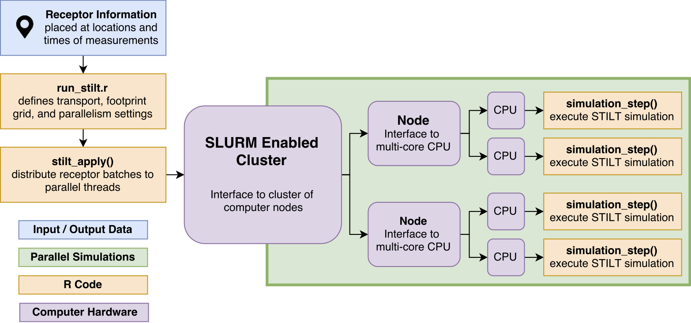
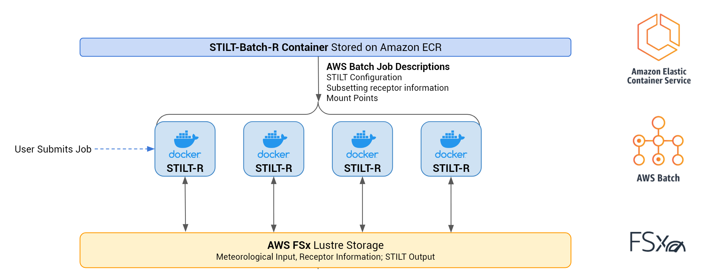
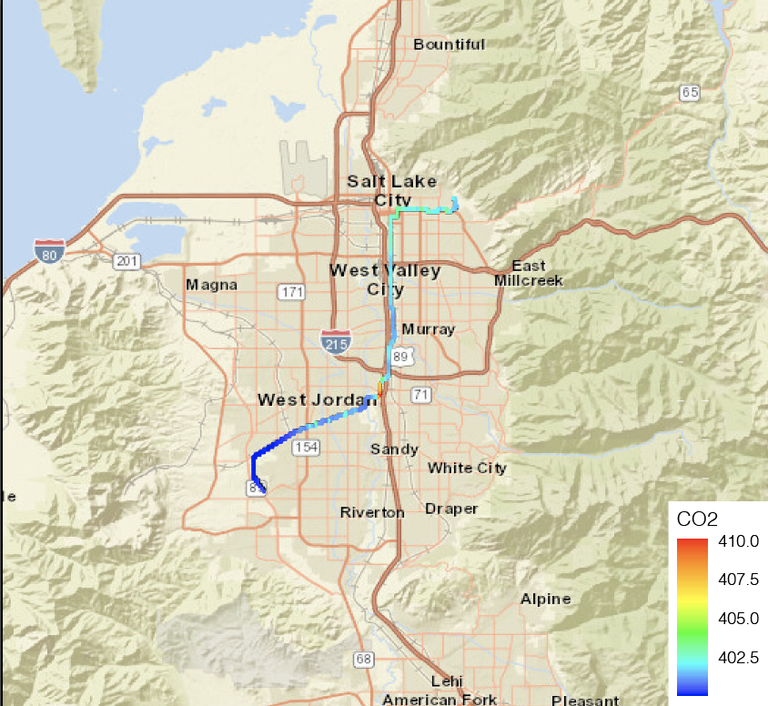
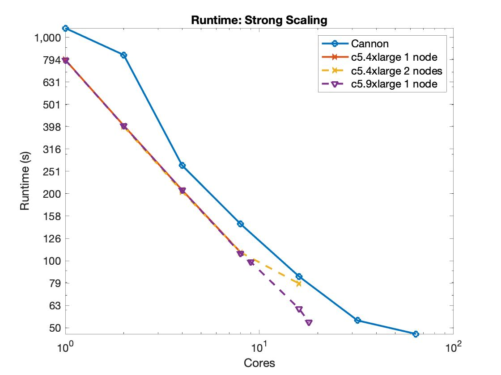
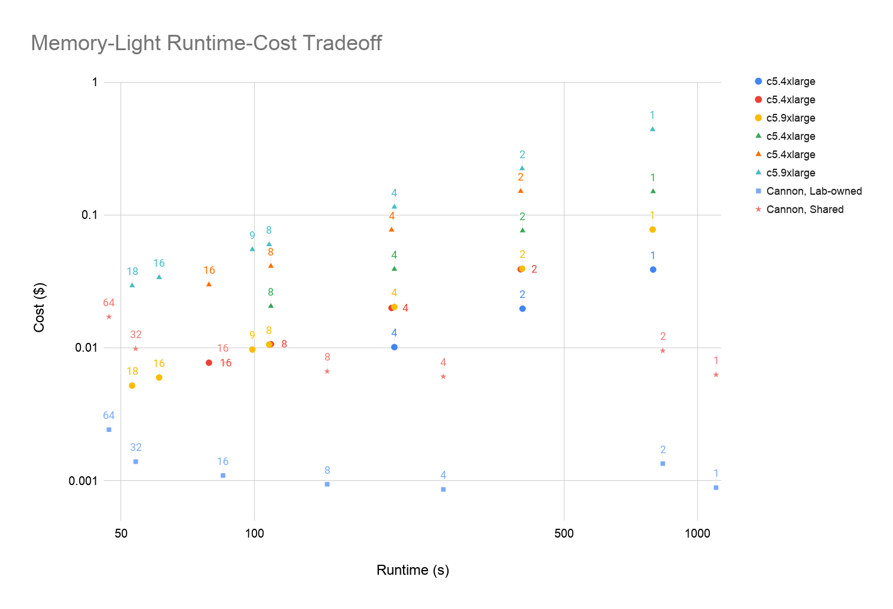

# CS205 Spring 2020 Final Project: STILT Parallelization 
Quick intro or sth 

- [CS205 Spring 2020 Final Project: STILT Parallelization](#cs205-spring-2020-final-project--stilt-parallelization)
  * [Abstract](#abstract)
  * [Introduction](#introduction)
    + [Problem Description](#problem-description)
    + [Model Code](#model-code)
    + [The Needs for HPC and Big Data](#the-needs-for-hpc-and-big-data)
    + [Solutions](#solutions)
  * [Test Cases Experiments](#test-cases-experiments)
  * [Parallel Architecture Design](#parallel-architecture-design)
    + [Software Architecture](#software-architecture)
    + [Parallel Methods and Performance Analysis](#parallel-methods-and-performance-analysis)
      - [SLURM-based node parallelization](#slurm-based-node-parallelization)
      - [AWS Batch-based parallelization](#aws-batch-based-parallelization)
      - [Performance Analysis: Memory-Light Case](#performance-analysis--memory-light-case)
      - [Performance Analysis: Memory-Intensive Case](#performance-analysis--memory-intensive-case)
    + [Reproducibility Information](#reproducibility-information)
      - [SLURM-based on Harvard Cannon](#slurm-based-on-harvard-cannon)
      - [SLURM-based on AWS Cloud](#slurm-based-on-aws-cloud)
      - [AWS Batch](#aws-batch)
  * [Conclusion](#conclusion)
  * [References](#references)

## Abstract
...

## Introduction
### Problem Description
Stochastic Time-Inverted Lagrangian Transport Model or STILT model is an atmospheric model that simulates air parcel movements using ensembles of particles starting from a particular time and location.  Although the model can run both forward and backward in time from the given starting location, the backward runs are more commonly used. The knowledge of air particle trajectories depends on the specified receptors, which are the locations that the measurements were made. From the information obtained via STILT, one can construct the influence of an atmospheric observation, which has proven to be extremely useful for understanding atmospheric datasets. As the numbers of particles and receptors increase, the information of specific atmospheric datasets increases as well as the computational cost. Thus, the main challenge of using STILT is to come up with optimal numbers of receptors, numbers of particles, and the time that needs to be running backward for.

### Model Code
The STILT model code used in this work is available at [the uataq/stilt repository](https://github.com/uataq/stilt). AWS Batch code is available in [reproducibility/aws-batch](https://github.com/jimmielin/cs205-spring-20-final/tree/master/reproducibility/aws-batch) of this repository.

### The Needs for HPC and Big Data

As atmospheric models develop to be increasingly higher resolution, lagrangian models such as STILT operate with higher resolution meteorological data and increasingly larger amounts of receptors and particles. The computational domain of the model has also seen an increase in size, drastically increasing the memory footprint of the problem. We demonstrate this very wide dynamic range in scale of computational intensity in the [experimental test cases](#test-cases-experiments) that we have selected for our project. While the lightweight case can be ran on conventional computing hardware with a megabytes-large memory footprint, the memory-intensive case requires nearly 16GB of memory per core with runtimes ranging to hours for each receptor on a state-of-the-art Intel Cascade Lake CPU. It is thus imperative to evaluate and expand STILT's parallel capabilities to High Performance Computing (HPC) enabling scientists to complete their model runs with better efficiency and shorter time, given the increasing computational requirements.

At the same time, conventional HPC clusters have disadvantages to user workflow. For example, there is significant difficulty in software configuration, data set accessibility, and research reproducibility due to most of the clusters being closed-access to a select group of researchers (Zhuang et al., 2019). With the increasing popularity of cloud computing and its use in HPC applications, we demonstrate STILT's capability on the Amazon Web Services (AWS) cloud using both a replication of a conventional HPC cluster using [AWS ParallelCluster](https://aws.amazon.com/hpc/parallelcluster/), a logical and seamless transition to private cloud HPC for users accustomed to traditional HPC clusters. We then propose a cloud-native containerized approach by developing a new Docker-based container and STILT interface allowing for on-demand deployment of compute resources to run STILT using [AWS Batch](https://aws.amazon.com/batch/).

### Solutions

In this project, we are applying a combination of two different solutions. The first solution is to use R Language based slurm batch commands to split the workload, simply following Fasoli et al. 2018's workflow. This solution is performed on both Harvard FAS Research Computer (i.e. Cannon) and AWS. The second solution is to develop a containerized, batch version of STILT designed for use on the AWS Cloud, with the ability of properly dealing with the input data, thus enables AWS Batch-based high-performance parallel executation of STILT. Detailed descriptions of both solutions and comparision with existing work is shown in section "Parallel Methods and Performance Analysis".

## Test Cases Experiments

We use two cases with different computational profiles to investigate STILT parallelization. A memory-lightweight case serves as proof-of-concept and is intended to be easily parallelizable. A second case is memory-intensive and ...

A STILT run requires the following datasets to run: (i) an emission dataset, (ii) a meteorological dataset, (iii) a receptor dataset, and (iv) an R script. 

For the memory-light case, we used what has been provided on the official STILT site.
https://uataq.github.io/stilt/tutorials/train.html

For the memory-intensive case, we used emission and receptor datasets based on a research project that studies greenhouse gas emissions in the New York City area. The meteorological product that we chose was the Global Forecast System. The meteorological reanalysis was from March 1st, 2019 https://www.ncdc.noaa.gov/data-access/model-data/model-datasets/global-forcast-system-gfs.

## Parallel Architecture Design

As a lagrangian particle model, tracing particles backward in time using STILT is a data-parallel or "embarassingly parallel" problem. However, STILT relies on a proprietary trajectory/dispersion model called [HYSPLIT](https://www.ready.noaa.gov/HYSPLIT.php), written in Fortran and the source code being unavailable for public access. Our parallelization efforts thus assume STILT's trajectory component being a closed-source black box that we have no control over. There [have been previous efforts to parallelize HYSPLIT using OpenMP and GPUs](https://ieeexplore.ieee.org/document/8778420) however their source is unavailable. As our developments have been in R STILT code, our improvements can work in tandem with any upstream changes in the underlying Fortran HYSPLIT code to further speed up the model.

STILT includes by default several approaches to parallelization, including process forking in a single-node operation, and using SLURM to create multiple distinct worker processes on each node for multi-node parallelization. This is accomplished as described in Fasoli et al., 2018.

We benchmark the existing SLURM-based parallel architecture in our work and develop a new cloud-native AWS Batch method allowing STILT workers to be spawned in containers with AWS, thus achieving easy horizontal scaling.

### Software Architecture

STILT is mostly written in [R](https://www.r-project.org/about.html) with a proprietary component, HYSPLIT, used for particle dispersion calculations. The source for STILT is free and open-source however HYSPLIT is proprietary and unavailable publicly and is only distributed with STILT in a binary form for a variety of platforms.

Our development for STILT-Batch is written in R.

### Parallel Methods and Performance Analysis
#### SLURM-based node parallelization

STILT includes a SLURM workload manager-based parallelization capability which we benchmark, analyze and optimized on the two computational cases previously described. The SLURM parallelization is developed in Fasoli et al., 2018 and uses SLURM to launch a set of processes on different nodes in a shared run directory. A schematic diagram for the parallelization pipeline from Fasoli et al., 2018 is shown here.



We benchmark this capability within two computing environments: first on the [Harvard Research Computing (RC) Cannon Cluster](https://www.rc.fas.harvard.edu/) where initial tests with STILT parallelization and workflow is tuned. Then we migrate this environment to the [Amazon Web Services Cloud (AWS)](https://aws.amazon.com) using [AWS ParallelCluster](https://aws.amazon.com/hpc/parallelcluster/) to set up private HPC environments for use with STILT. The costs and optimal configuration for each computing environment is analyzed in our work.

An important to note is that the cost analysis in our writeup is performed using [reference numbers for Cannon cluster cost](#slurm-based-on-harvard-cannon) and [AWS Spot instance pricing](https://aws.amazon.com/ec2/spot/pricing/). While we have not encountered this issue in our testing, **there is a possibility that spot instances launched are terminated due to capacity limitations** (outbid by on-demand instances). For potential time-critical applications of STILT on the Cloud, it may be prudent to use a less congested region (we use `us-east-2`), on-demand instances, or develop a script to automatically resume jobs that were terminated due to spot capacity. It may be easier to perform this in AWS Batch as "data subsetting" essentially serves as a crude method for checkpointing work.

#### AWS Batch-based parallelization

We develop a containerized, batch version of STILT designed for use on the AWS Cloud with AWS Batch. STILT includes a Docker container capability, however it only containerizes single-particle simulations on STILT, which incurs excessive overhead if a new container is deployed for every particle. The existing Docker container is further developed and a new version of the run script is built to allow for subsetting of input data and writing into a shared high-performance file system on AWS, powered by AWS FSx.

The new batch container is called STILT-batch and stored on AWS ECS (Elastic Container Service) repositories for private use, but can be readily publicly deployed in the future with permission from the STILT developers adopting our new code.

The previous STILT docker run script only accepted single particles, rendering it inappropriate for AWS Batch usage. The newly developed script accepts subsetting arguments that allow all batch processes to read from a single particle `RData` file, thus saving the user from troubles subsetting their data. The data subsetting is a simple even split in its current form and may be improved in the future to allow for dynamic load balancing. However, load balancing is likely not to be a significant issue in the current implementation, as once subset input data is fed into each batch worker, in-worker parallelization is achieved using dynamic scheduling of forked tasks.

We thus use the following architecture for our AWS Batch based parallelization approach:



This approach is a hybrid parallel approach. It is parallel at the node level by launching multiple batch workers, and parallel within nodes by launching multiple processes within each batch worker.

We benchmark this AWS Batch-based parallelization approach with the memory-intensive benchmark case, by using different container sizes (number of cores per node) and different number of containers (number of nodes), and comparing to previous results for cost-efficiency and scalability.

Due to the significant overhead associated with launching new EC2 instances, AWS Batch should only be used in a situation where the test case is sufficiently computationally intensive. For the "memory-light" case previously mentioned it may be simpler to use one large EC2 instance. The AWS Batch parallelization is most efficiently used in memory and compute-intensive cases that take a long time to run and can be efficiently sped up with horizontal scaling. As demonstrated in our test results, AWS Batch jobs enable "infinite" horizontal scaling of instances. It is important to note that we do not consider the overhead of launching the EC2 instances in our testing, as the instances have been previously pre-started by specifying a "Minimum vCPU" parameter in the AWS Batch Compute Environment description. In our experience it takes anytime from 2-5 minutes to spin up EC2 instances that are ready for use in Batch: thus the target computational time should be at least an order of magnitude higher than this time frame to be efficient.

Results for the memory-intensive case using AWS Batch:
| Node Type  | # of Workers | CPUs/Worker | Runtime [s] | EC2 Cost [$] | Total Cost [$] |
| ---------  | ------------ | ----------- | ----------- | --------     | -------------- |
| r5.8xlarge | 1 | 16 | 5940 | 0.5519 | 1.3657 |
| r5.2xlarge | 4 | 4 | 4385 | 0.4175 | 1.0183 |
| r5.2xlarge | 5 | 4 | 4901 | 0.5834 | 1.2548 |
| r5.2xlarge | 10 | 4 | 2595 | 0.6178 | 0.9733 |
| r5.2xlarge | 20 | 4 | 1694 | 0.8065 | 1.039 |

Cost is calculated using the spot instance price of $0.0857/hr for r5.2xlarge and $0.3345/hr for r5.4xlarge. FSx costs are included in the "Total Cost" column using $0.000137/second from calculations in the "Reproducibility" section below. We utilize FSx for fastest performance and throughput, but using slower, conventional SSD storage such as Amazon EFS may be possible on AWS Batch. Further information [is available in the AWS Documentation for AWS Batch](https://docs.aws.amazon.com/batch/latest/userguide/launch-templates.html).

The AWS Batch case is then best optimized according to the following guidelines:
* Favor a larger amount of smaller, cheaper instances over "fat nodes". Due to this case being memory-constrained, the `r5` family of memory-optimized nodes is used. The `r5` nodes are priced non-linearly: for example, `r5.4xlarge` spot pricing ($0.1933/hour as of time of writing) is more than 2x the `r5.2xlarge` at $0.0855/hour. If the workload scales well, simply scale horizontally rather than using larger nodes.

* Ensure that the workload (**measured in particle count**) can be evenly divisible by **both** the # of workers used and number of CPUs per worker. For example, in terms of raw compute costs, the 4x4 `r5.2xlarge` case is much more efficient than the 10x4 or 20x4 `r5.2xlarge` cases, simply because we use 100 receptors that can be well divided into groups of 25 then later groups of 6. As the workload for each single particle can only run on one CPU (it is a time series problem that cannot be parallelized further), the workload must be well-distributed to prevent any kind of obvious unbalance. While the "optimal" configuration theoretically should be to distribute over 5 workers with 4 nodes, so the workload is distributed in 5x4x5=100, in reality this results in a higher cost than the 4-node case -- so it seems like there may be slight unbalances in the workload complicating the issue.

* Take in account the cost of the storage. Amazon FSx is **very** expensive and so is your time. In this case try to use more nodes while preventing excessive fragmentation.

#### Performance Analysis: Memory-Light Case

The Memory-Light case focuses on the CO2 concentration along a part of the light-rail around Salt Lake City, where a major developer of STILT-R model, Fasoli, current works. It comprised of 215 receptors. The footprint for each receptor is calculated, and is then convolved with the emission inventory to get the total CO2 at the location of each receptor. Here we excluded the part of calculating the convolution when discussing about the performance, because that part is relatively fast and also, totally serialized. The full output of the model is shown in the figure below. It is a relatively memory-light case. The meteorological data has been properly subsetted, thus the memory requirement for each CPU is less than 4 GBs.

<p align="center">
  
</p>

Two sets of experienments are conducted here. The first one is the strong scaling experienment, with a fixed problem size of. The full 215 receptors are used in this set. The program is run with both Cannon and AWS slurms. The change of the runtime with the number of cores is shown in the figure below. It can be seen that the runtime scales almost perfectly with the increase of cores, in all the experienments. The runtime in AWS experiments is generally shorter than the cases in Cannon runs, due to the difference of the machines. The experiments on AWS scales better than on Cannon, which demonstrates the potentially more robust performance of AWS machines. Interestingly, when using 64 cores on Cannon, or 16 cores on AWS C5.4 xlarge with two worker nodes, turning points appears comparing with the performances with less cores. A potential reason for that might due to the loading unbalance among different cores. When number of cores increases, the chance of having significant unbalance will also increase, because the number receptors on each core is relatively small. Further experienments need to be done to explore whether the turning point is robust.

The cost for this strong scaling experiment set with different settings is also calculated, to serve as a reference for the more realistic memory-intensive case. The cost-runtime plot is shown below. Certain trade off can be seen in Cannon experienments, while the costs simply increase with the number of cores in AWS experienments. That is because on AWS, the program is ran on a totally occupied manner, i.e. when using the same amount of workers, the price will be the same, no matter how many cores are used. This is significantly form the mixed manner of Cannon, i.e. different job can share the same nodes. In the memory-light case, only one or two nodes on AWS would be enough to get the model finished relatively fast, thats why the trade off does not appear on AWS. 
<p align="center">
  
  
</p>

The second set of experiment is the memory-light case. In this experiment, we decided to simply decrease the number of receptors, instead of increasing it. We evenly use a subset of the total 215 receptors, with different number of cores. To be specified, we use 13 receptors for 1 core, 26 receptors for 2 cores,..., and 208 receptors for 16 cores. We are doing this weak scaling test only to check that whether the the performance scales good with the number of problem size, and the answer is "yes" according to the figure below. We can see that the runtime does not change significantly with the scale of the problem (or the number of cores). The runtime for the serial run is also plotted here as a reference.
<p align="center">
  
</p>

#### Performance Analysis: Memory-Intensive Case

The memory-intensive case is based on a real scientific research problem of determining sources of particles detected during a flight campaign. 

The AWS-Batch data is available in the [AWS Batch-based parallelization section](#aws-batch-based-parallelization) and is not reproduced here for brevity.

...

### Reproducibility Information
#### SLURM-based on Harvard Cannon
##### Partitions
The memory-light case is conducted on huce_cascade partition of Cannon, which belongs to the Harvard University Center for the Environment (HUCE). This partition is comprised of 2880 cores of water cooled Intel Cascade Lake, each node has 48 cores and 192 GB of RAM. Subject to requeue by huce_cascade_priority. A document for this partition can be found at https://docs.rc.fas.harvard.edu/kb/huce-partitions/.
The memory-intensive case is runned on .....(Ju)
##### Cost model
We are not really asked to pay for the resources we used on Cannon, that said, we can still refer to the Billing model of FASRC for other schools around Harvard, to get a estimation for the cost for the computational resources. This cost can serve as a reference relative to the cost of AWS nodes. The cost model can be find at the following two websites: 1. https://www.rc.fas.harvard.edu/policy/billing-faq/; 2. https://docs.rc.fas.harvard.edu/kb/fairshare/. Generally speaking, the cost model for the huce_cascade partition follows the table below. We separately calculated the cost for the two different types shown here (Shared/Lab Owned), as a reference for different type of users.

| TYPE | SERVICE UNIT | COST PER CPU/HR |
| ---------  | ------------ | ----------- |
| Shared | 1 Core + 6GB RAM | $0.0205 | 
| requeue/Lab Owned | 1 Core + 6GB RAM | $0.0029 |


#### SLURM-based on AWS Cloud
Please refer to the [STILT on AWS - ParallelCluster workflow document](https://github.com/jimmielin/cs205-spring-20-final/blob/master/docs/stilt_aws_slurm_workflow.md). The primary elements of the set up include:

* **AWS-ParallelCluster.** ([GitHub](https://github.com/aws/aws-parallelcluster)) An automatic deployment tool for managing HPC clusters on the AWS cloud. 

* **Spack.** ([Github](https://github.com/spack/spack)) Used for deploying the software environment on the cloud for use in both master and compute nodes.

* **Master Node** is powered using `t3.micro`, covered by the AWS Free Tier, during compute runs. The environment is set up on `t3.2xlarge` for higher performance; the master node can later be downgraded with no negative effects.

* **Compute Nodes** are deployed using various different [AWS EC2 instance types](https://aws.amazon.com/ec2/instance-types/) by tweaking the respective cluster launch template and auto scaling group.

#### AWS Batch

Please refer to the [STILT on AWS - AWS Batch container creation](https://github.com/jimmielin/cs205-spring-20-final/blob/master/docs/stilt_aws_docker_workflow.md) for the creation steps for the container.

* **FSx High-Performance File System**: Created on `us-east-2` with storage capacity of `1.2 TiB` and `200 MB/s/TiB (up to 1.3 GB/s/TiB burst)` highest-performance option for a throughput capacity of `234 MB/s`. Mounted on `/fsx` through all AWS Batch instances. Pricing is calculated using **persistent, 200 MB/s/TiB baseline** cost of `$0.29/GB/month`. For this instance this works out to be `$356.352/month` or `$0.000137/second`.

Manual mount of this file system from within another EC2 instance is through the Lustre client:
```
sudo mount -t lustre -o noatime,flock fs-0a65a1969f67faf8b.fsx.us-east-2.amazonaws.com@tcp:/c5lb5bmv /fsx
```

Obtain the mount name (corresponding to the part after `tcp:/`) from `aws fsx describe-filesystems`. This has recently changed. Be careful.

Make sure that [the VPC security groups are correctly configured](https://docs.aws.amazon.com/fsx/latest/LustreGuide/limit-access-security-groups.html#fsx-vpc-security-groups) for both the FSx VPC and the VPC security group corresponding to the instances accessing the Lustre file system.

If all else fails, [here is troubleshooting instructions](https://docs.aws.amazon.com/fsx/latest/LustreGuide/troubleshooting.html).

Filesystem input setup:
```
$ ls -R /fsx
/fsx:        in  out
  /fsx/in:     HundredReceptors.RData  met
    /fsx/in/met:  20190301_gfs0p25
  /fsx/out:
```

* **Docker container stored on Amazon ECS (Elastic Container Storage).** Costs for AWS ECS not considered as it can be easily covered in the AWS ECR free-tier of 500 MB/month storage. Our container is sized twice the allowance but it does not need to be kept for long:

```
$ docker images --filter reference=stilt
REPOSITORY          TAG                 IMAGE ID            CREATED             SIZE
stilt               latest              7e6c965f4677        4 hours ago         1.86GB
```

* **Launch Template**. Uses user data to mount the Lustre file system at `fsx`:
```
MIME-Version: 1.0
Content-Type: multipart/mixed; boundary="==MYBOUNDARY=="

--==MYBOUNDARY==
Content-Type: text/cloud-config; charset="us-ascii"

runcmd:
- file_system_id_01=fs-0a65a1969f67faf8b
- region=us-east-2
- fsx_directory=/c5lb5bmv
- amazon-linux-extras install -y lustre2.10
- mkdir -p ${fsx_directory}
- mount -t lustre ${file_system_id_01}.fsx.${region}.amazonaws.com@tcp:/c5lb5bmv ${fsx_directory}

--==MYBOUNDARY==--
```
In addition to a 8GB `gp2` mount at `/dev/xva` for base node-local storage.

* **Setting up AWS Batch**:
  + **Create Spot Fleet Role** for IAM [following these instructions](https://docs.aws.amazon.com/batch/latest/userguide/spot_fleet_IAM_role.html).
  + **Create Launch Template** as above.
  + **Create AWS Batch Compute Environment**: Created with `r5.2xlarge` (4C8T, 64GB Memory) instances only, accommodating 4 cores each. We use fixed instance types in our project but this could easily be adapted to scale to any combination of spot r5 instances. Use spot instances with the previously created spot fleet. Choose the `StiltBatchLT` launch template created above. Use the **Amazon Linux 2** [AMI](https://docs.aws.amazon.com/AmazonECS/latest/developerguide/ecs-optimized_AMI.html) (for `us-east-2` the AMI ID is `ami-0d9ef3d936a8fa1c6` as of time or writing)
  + **Create AWS Batch Job Queue** matching the compute environment above.
  + **Create Job Definition** using the `132714586118.dkr.ecr.us-east-2.amazonaws.com/stilt:latest` container stored as the "Container Image". Size is 4 vCPUs (cores) and `63500 MiB`. Make it slightly less than actual memory or it will be stuck in RUNNABLE. Set a volume with name "fsx" pointing to source path `/fsx` and a mount point in the container path `/fsx` with source volume "fsx". Set another volume "fsx-out" pointing to source path `/fsx/out` and a mount point in the container path `/app/out` with source volume "fsx-out" for output.

* **Sample job**:
```
stilt_wd=/app recep_file_loc=/fsx/in/HundredReceptors.RData recep_idx_s=1 recep_idx_e=25 met_dir=/fsx/in/met met_file_format=%Y%m%d_gfs0p25 xmn=-74.8 xmx=-71 ymn=39.7 ymx=42.1 xres=0.01 yres=0.01 ncores=4
```
  + Note the core count to use within each instance needs to be specified **both** in the job definition (to use **the number of logical cores**) and in the docker command (`ncores` parameter, using **the number of physical cores**). A detailed writeup of the effects of hyper-threading [is available from the AWS blog](https://aws.amazon.com/blogs/compute/disabling-intel-hyper-threading-technology-on-amazon-linux/).
  + The data subsetting start and end index ranges are specified using `recep_idx_s` and `recep_idx_e`.
  + Other STILT parameters are passed in as usual.

At present, job launches using AWS Batch have to use the console to dispatch jobs manually. This is a limitation in scope of our work but can be overcome by writing a shell script for controlling the [AWS CLI](https://aws.amazon.com/cli/).

## Conclusion 

We have presented as a project an analysis of existing STILT parallelization infrastructure and adapted it to a cloud-native parallel approach. Using the existing SLURM-based parallelization capability, we've benchmarked STILT using a traditional HPC cluster on Harvard RC Cannon and built a cloud equivalent using AWS ParallelCluster.

To supplement the parallelization capability of STILT and expand horizontal scaling capabilities and use cloud instance types more efficiently, we've developed a new cloud-native workflow based on AWS Batch. We develop a new Docker-based STILT container with a new R-based launcher script allowing for input data subsetting. We supplement this new architecture with a high-performance Lustre file system powered by Amazon FSx too ease any potential I/O bottleneck caused by a large amount of nodes reading and writing data concurrently.

Our analysis shows that AWS Batch offers best scaling capabilities and performance at comparable low-cost compared to subsidized clusters like Cannon and AWS HPC clusters. However, while we have demonstrated this analysis using both a simple memory-light case and a memory-intensive case, future work may involve the development of a test suite to better measure the limitations of parallel capabilities of STILT.

In its current implementation, STILT-Batch also requires manually configuring the Batch environment and may be better supplemented with the implementation of a "one-click" provisioning system using the AWS CLI, to ease users' transition to utilizing cloud computing.


## References
Fasoli, B., Lin, J. C., Bowling, D. R., Mitchell, L., and Mendoza, D.: Simulating atmospheric tracer concentrations for spatially distributed receptors: updates to the Stochastic Time-Inverted Lagrangian Transport model's R interface (STILT-R version 2), Geosci. Model Dev., 11, 2813–2824, https://doi.org/10.5194/gmd-11-2813-2018, 2018.

Zhuang, J., Jacob, D. J., Flo Gaya, J., Yantosca, R. M., Lundgren, E. W., Sulprizio, M. P. and Eastham, S. D.: Enabling Immediate Access to Earth Science Models through Cloud Computing: Application to the GEOS-Chem Model, Bull. Amer. Meteor. Soc., 100, 1943-1940, https://doi.org/10.1175/BAMS-D-18-0243.1, 2019.
