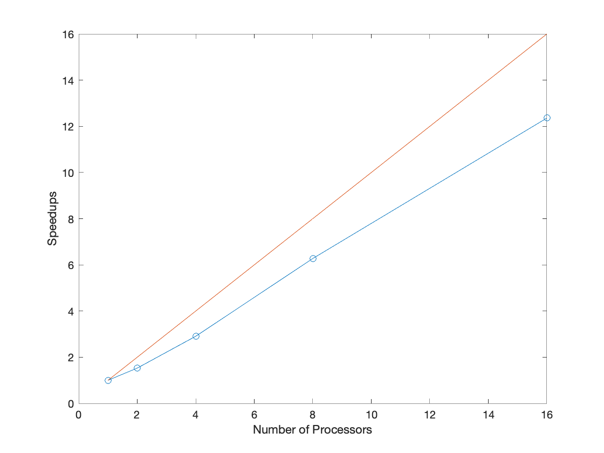

# CS205 Spring 2020 Final Project: STILT Parallelization 
Quick intro or sth 

- [CS205 Spring 2020 Final Project: STILT Parallelization](#cs205-spring-2020-final-project--stilt-parallelization)
  * [Abstract](#abstract)
  * [Introduction](#introduction)
    + [Problem Description](#problem-description)
    + [Model Code](#model-code)
    + [The Needs for HPC and Big Data](#the-needs-for-hpc-and-big-data)
    + [Solutions](#solutions)
  * [Test Cases Experiments](#test-cases-experiments)
  * [Parallel Architecture Design](#parallel-architecture-design)
    + [Software Architecture](#software-architecture)
    + [Parallel Methods and Performance Analysis](#parallel-methods-and-performance-analysis)
      - [SLURM-based node parallelization](#slurm-based-node-parallelization)
      - [AWS Batch-based parallelization](#aws-batch-based-parallelization)
      - [Performance Analysis: Memory-Light Case](#performance-analysis--memory-light-case)
      - [Performance Analysis: Memory-Intensive Case](#performance-analysis--memory-intensive-case)
    + [Reproducibility Information](#reproducibility-information)
      - [SLURM-based on Harvard Cannon](#slurm-based-on-harvard-cannon)
      - [SLURM-based on AWS Cloud](#slurm-based-on-aws-cloud)
      - [AWS Batch](#aws-batch)
  * [Conclusion](#conclusion)
  * [References](#references)

## Abstract
...

## Introduction
### Problem Description
Stochastic Time-Inverted Lagrangian Transport Model or STILT model is an atmospheric model that simulates air parcel movements using ensembles of particles starting from a particular time and location.  Although the model can run both forward and backward in time from the given starting location, the backward runs are more commonly used. The knowledge of air particle trajectories depends on the specified receptors, which are the locations that the measurements were made. From the information obtained via STILT, one can construct the influence of an atmospheric observation, which has proven to be extremely useful for understanding atmospheric datasets. As the numbers of particles and receptors increase, the information of specific atmospheric datasets increases as well as the computational cost. Thus, the main challenge of using STILT is to come up with optimal numbers of receptors, numbers of particles, and the time that needs to be running backward for.

### Model Code
The STILT model code used in this work is available at [the uataq/stilt repository](https://github.com/uataq/stilt). AWS Batch code is available in [reproducibility/aws-batch](https://github.com/jimmielin/cs205-spring-20-final/tree/master/reproducibility/aws-batch) of this repository.

### The Needs for HPC and Big Data

...

### Solutions

In this project, we are applying a combination of two different solutions. The first solution is to use R Language based slurm batch commands to split the workload, simply following Fasoli et al. 2018's workflow. This solution is performed on both Harvard FAS Research Computer (i.e. Cannon) and AWS. The second solution is to develop a containerized, batch version of STILT designed for use on the AWS Cloud, with the ability of properly dealing with the input data, thus enables AWS Batch-based high-performance parallel executation of STILT. Detailed descriptions of both solutions and comparision with existing work is shown in section "Parallel Methods and Performance Analysis".

## Test Cases Experiments

We use two cases with different computational profiles to investigate STILT parallelization. A memory-lightweight case serves as proof-of-concept and is intended to be easily parallelizable. A second case is memory-intensive and ...

A STILT run requires the following datasets to run: (i) an emission dataset, (ii) a meteorological dataset, (iii) a receptor dataset, and (iv) an R script. 

For the memory-light case, we used what has been provided on the official STILT site.
https://uataq.github.io/stilt/tutorials/train.html

For the memory-intensive case, we used emission and receptor datasets based on a research project that studies greenhouse gas emissions in the New York City area. The meteorological product that we chose was the Global Forecast System. The meteorological reanalysis was from March 1st, 2019 https://www.ncdc.noaa.gov/data-access/model-data/model-datasets/global-forcast-system-gfs.

## Parallel Architecture Design

As a lagrangian particle model, tracing particles backward in time using STILT is a data-parallel or "embarassingly parallel" problem. However, STILT relies on a proprietary trajectory/dispersion model called [HYSPLIT](https://www.ready.noaa.gov/HYSPLIT.php), written in Fortran and the source code being unavailable for public access. Our parallelization efforts thus assume STILT's trajectory component being a closed-source black box that we have no control over. There [have been previous efforts to parallelize HYSPLIT using OpenMP and GPUs](https://ieeexplore.ieee.org/document/8778420) however their source is unavailable. As our developments have been in R STILT code, our improvements can work in tandem with any upstream changes in the underlying Fortran HYSPLIT code to further speed up the model.

STILT includes by default several approaches to parallelization, including process forking in a single-node operation, and using SLURM to create multiple distinct worker processes on each node for multi-node parallelization. This is accomplished as described in Fasoli et al., 2018.

We benchmark the existing SLURM-based parallel architecture in our work and develop a new cloud-native AWS Batch method allowing STILT workers to be spawned in containers with AWS, thus achieving easy horizontal scaling.

### Software Architecture

STILT is mostly written in [R](https://www.r-project.org/about.html) with a proprietary component, HYSPLIT, used for particle dispersion calculations. The source for STILT is free and open-source however HYSPLIT is proprietary and unavailable publicly and is only distributed with STILT in a binary form for a variety of platforms.

Our development for STILT-Batch is written in R.

### Parallel Methods and Performance Analysis
#### SLURM-based node parallelization

STILT includes a SLURM workload manager-based parallelization capability which we benchmark, analyze and optimized on the two computational cases previously described. The SLURM parallelization is developed in Fasoli et al., 2018 and uses SLURM to launch a set of processes on different nodes in a shared run directory. A schematic diagram for the parallelization pipeline from Fasoli et al., 2018 is shown here.


We benchmark this capability within two computing environments: first on the [Harvard Research Computing (RC) Cannon Cluster](https://www.rc.fas.harvard.edu/) where initial tests with STILT parallelization and workflow is tuned. Then we migrate this environment to the [Amazon Web Services Cloud (AWS)](https://aws.amazon.com) using [AWS ParallelCluster](https://aws.amazon.com/hpc/parallelcluster/) to set up private HPC environments for use with STILT. The costs and optimal configuration for each computing environment is analyzed in our work. 

#### AWS Batch-based parallelization

We develop a containerized, batch version of STILT designed for use on the AWS Cloud with AWS Batch. STILT includes a Docker container capability, however it only containerizes single-particle simulations on STILT, which incurs excessive overhead if a new container is deployed for every particle. The existing Docker container is further developed and a new version of the run script is built to allow for subsetting of input data and writing into a shared high-performance file system on AWS, powered by AWS FSx.

The new batch container is called STILT-batch and stored on AWS ECS (Elastic Container Service) repositories for private use, but can be readily publicly deployed in the future with permission from the STILT developers adopting our new code.

The previous STILT docker run script only accepted single particles, rendering it inappropriate for AWS Batch usage. The newly developed script accepts subsetting arguments that allow all batch processes to read from a single particle `RData` file, thus saving the user from troubles subsetting their data. The data subsetting is a simple even split in its current form and may be improved in the future to allow for dynamic load balancing. However, load balancing is likely not to be a significant issue in the current implementation, as once subset input data is fed into each batch worker, in-worker parallelization is achieved using dynamic scheduling of forked tasks.

We thus use the following architecture for our AWS Batch based parallelization approach:


This approach is a hybrid parallel approach. It is parallel at the node level by launching multiple batch workers, and parallel within nodes by launching multiple processes within each batch worker.

We benchmark this AWS Batch-based parallelization approach with the memory-intensive benchmark case, by using different container sizes (number of cores per node) and different number of containers (number of nodes), and comparing to previous results for cost-efficiency and scalability.

Due to the significant overhead associated with launching new EC2 instances, AWS Batch should only be used in a situation where the test case is sufficiently computationally intensive. For the "memory-light" case previously mentioned it may be simpler to use one large EC2 instance. The AWS Batch parallelization is most efficiently used in memory and compute-intensive cases that take a long time to run and can be efficiently sped up with horizontal scaling. As demonstrated in our test results, AWS Batch jobs enable "infinite" horizontal scaling of instances. It is important to note that we do not consider the overhead of launching the EC2 instances in our testing, as the instances have been previously pre-started by specifying a "Minimum vCPU" parameter in the AWS Batch Compute Environment description. In our experience it takes anytime from 2-5 minutes to spin up EC2 instances that are ready for use in Batch: thus the target computational time should be at least an order of magnitude higher than this time frame to be efficient.

Results for the memory-intensive case using AWS Batch:
| Node Type  | # of Workers | CPUs/Worker | Runtime [s] | EC2 Cost [$] | Total Cost [$] |
| ---------  | ------------ | ----------- | ----------- | --------     | -------------- |
| r5.8xlarge | 1 | 16 | 5940 | 0.5519 | 1.3657 |
| r5.2xlarge | 4 | 4 | 4385 | 0.4175 | 1.0183 |
| r5.2xlarge | 5 | 4 | 4901 | 0.5834 | 1.2548 |
| r5.2xlarge | 10 | 4 | 2595 | 0.6178 | 0.9733 |
| r5.2xlarge | 20 | 4 | 1694 | 0.8065 | 1.039 |

Cost is calculated using the spot instance price of $0.0857/hr for r5.2xlarge and $0.3345/hr for r5.4xlarge. FSx costs are included in the "Total Cost" column using $0.000137/second from calculations in the "Reproducibility" section below. We utilize FSx for fastest performance and throughput, but using slower, conventional SSD storage such as Amazon EFS may be possible on AWS Batch. Further information [is available in the AWS Documentation for AWS Batch](https://docs.aws.amazon.com/batch/latest/userguide/launch-templates.html).

The AWS Batch case is then best optimized according to the following guidelines:
* Favor a larger amount of smaller, cheaper instances over "fat nodes". Due to this case being memory-constrained, the `r5` family of memory-optimized nodes is used. The `r5` nodes are priced non-linearly: for example, `r5.4xlarge` spot pricing ($0.1933/hour as of time of writing) is more than 2x the `r5.2xlarge` at $0.0855/hour. If the workload scales well, simply scale horizontally rather than using larger nodes.

* Ensure that the workload (**measured in particle count**) can be evenly divisible by **both** the # of workers used and number of CPUs per worker. For example, in terms of raw compute costs, the 4x4 `r5.2xlarge` case is much more efficient than the 10x4 or 20x4 `r5.2xlarge` cases, simply because we use 100 receptors that can be well divided into groups of 25 then later groups of 6. As the workload for each single particle can only run on one CPU (it is a time series problem that cannot be parallelized further), the workload must be well-distributed to prevent any kind of obvious unbalance. While the "optimal" configuration theoretically should be to distribute over 5 workers with 4 nodes, so the workload is distributed in 5x4x5=100, in reality this results in a higher cost than the 4-node case -- so it seems like there may be slight unbalances in the workload complicating the issue.

* Take in account the cost of the storage. Amazon FSx is **very** expensive and so is your time. In this case try to use more nodes while preventing excessive fragmentation.

#### Performance Analysis: Memory-Light Case
...


Weak Scaling runtime and speed up.



#### Performance Analysis: Memory-Intensive Case

...

### Reproducibility Information
#### SLURM-based on Harvard Cannon
##### Partitions
The memory-light case is conducted on huce_cascade partition of Cannon, which belongs to the Harvard University Center for the Environment (HUCE). This partition is comprised of 2880 cores of water cooled Intel Cascade Lake, each node has 48 cores and 192 GB of RAM. Subject to requeue by huce_cascade_priority. A document for this partition can be found at https://docs.rc.fas.harvard.edu/kb/huce-partitions/.
The memory-intensive case is runned on .....(Ju)
##### Cost model
We are not really asked to pay for the resources we used on Cannon, that said, we can still refer to the Billing model of FASRC for other schools around Harvard, to get a estimation for the cost for the computational resources. This cost can serve as a reference relative to the cost of AWS nodes. The cost model can be find at the following two websites: 1. https://www.rc.fas.harvard.edu/policy/billing-faq/; 2. https://docs.rc.fas.harvard.edu/kb/fairshare/. Generally speaking, the cost model for the huce_cascade partition follows the table below. We separately calculated the cost for the two different types shown here (Shared/Lab Owned), as a reference for different type of users.
| TYPE | SERVICE UNIT | COST PER CPU/HR|
| ---------  | ------------ | ----------- |
| Shared | 1 Core + 6GB RAM | $0.0205 | 
| requeue/Lab Owned | 1 Core + 6GB RAM | $0.0029| 


#### SLURM-based on AWS Cloud
Please refer to the [STILT on AWS - ParallelCluster workflow document](https://github.com/jimmielin/cs205-spring-20-final/blob/master/docs/stilt_aws_slurm_workflow.md). The primary elements of the set up include:

* **AWS-ParallelCluster.** ([GitHub](https://github.com/aws/aws-parallelcluster)) An automatic deployment tool for managing HPC clusters on the AWS cloud. 

* **Spack.** ([Github](https://github.com/spack/spack)) Used for deploying the software environment on the cloud for use in both master and compute nodes.

* **Master Node** is powered using `t3.micro`, covered by the AWS Free Tier, during compute runs. The environment is set up on `t3.2xlarge` for higher performance; the master node can later be downgraded with no negative effects.

* **Compute Nodes** are deployed using various different [AWS EC2 instance types](https://aws.amazon.com/ec2/instance-types/) by tweaking the respective cluster launch template and auto scaling group.

#### AWS Batch

Please refer to the [STILT on AWS - AWS Batch container creation](https://github.com/jimmielin/cs205-spring-20-final/blob/master/docs/stilt_aws_docker_workflow.md) for the creation steps for the container.

* **FSx High-Performance File System**: Created on `us-east-2` with storage capacity of `1.2 TiB` and `200 MB/s/TiB (up to 1.3 GB/s/TiB burst)` highest-performance option for a throughput capacity of `234 MB/s`. Mounted on `/fsx` through all AWS Batch instances. Pricing is calculated using **persistent, 200 MB/s/TiB baseline** cost of `$0.29/GB/month`. For this instance this works out to be `$356.352/month` or `$0.000137/second`.

Manual mount of this file system from within another EC2 instance is through the Lustre client:
```
sudo mount -t lustre -o noatime,flock fs-0a65a1969f67faf8b.fsx.us-east-2.amazonaws.com@tcp:/c5lb5bmv /fsx
```

Obtain the mount name (corresponding to the part after `tcp:/`) from `aws fsx describe-filesystems`. This has recently changed. Be careful.

Make sure that [the VPC security groups are correctly configured](https://docs.aws.amazon.com/fsx/latest/LustreGuide/limit-access-security-groups.html#fsx-vpc-security-groups) for both the FSx VPC and the VPC security group corresponding to the instances accessing the Lustre file system.

If all else fails, [here is troubleshooting instructions](https://docs.aws.amazon.com/fsx/latest/LustreGuide/troubleshooting.html).

Filesystem input setup:
```
$ ls -R /fsx
/fsx:        in  out
  /fsx/in:     HundredReceptors.RData  met
    /fsx/in/met:  20190301_gfs0p25
  /fsx/out:
```

* **Docker container stored on Amazon ECS (Elastic Container Storage).** Costs for AWS ECS not considered as it can be easily covered in the AWS ECR free-tier of 500 MB/month storage. Our container is sized twice the allowance but it does not need to be kept for long:

```
$ docker images --filter reference=stilt
REPOSITORY          TAG                 IMAGE ID            CREATED             SIZE
stilt               latest              7e6c965f4677        4 hours ago         1.86GB
```

* **Launch Template**. Uses user data to mount the Lustre file system at `fsx`:
```
MIME-Version: 1.0
Content-Type: multipart/mixed; boundary="==MYBOUNDARY=="

--==MYBOUNDARY==
Content-Type: text/cloud-config; charset="us-ascii"

runcmd:
- file_system_id_01=fs-0a65a1969f67faf8b
- region=us-east-2
- fsx_directory=/c5lb5bmv
- amazon-linux-extras install -y lustre2.10
- mkdir -p ${fsx_directory}
- mount -t lustre ${file_system_id_01}.fsx.${region}.amazonaws.com@tcp:/c5lb5bmv ${fsx_directory}

--==MYBOUNDARY==--
```
In addition to a 8GB `gp2` mount at `/dev/xva` for base node-local storage.

* **Setting up AWS Batch**:
  + **Create Spot Fleet Role** for IAM [following these instructions](https://docs.aws.amazon.com/batch/latest/userguide/spot_fleet_IAM_role.html).
  + **Create Launch Template** as above.
  + **Create AWS Batch Compute Environment**: Created with `r5.2xlarge` (4C8T, 64GB Memory) instances only, accommodating 4 cores each. We use fixed instance types in our project but this could easily be adapted to scale to any combination of spot r5 instances. Use spot instances with the previously created spot fleet. Choose the `StiltBatchLT` launch template created above. Use the **Amazon Linux 2** [AMI](https://docs.aws.amazon.com/AmazonECS/latest/developerguide/ecs-optimized_AMI.html) (for `us-east-2` the AMI ID is `ami-0d9ef3d936a8fa1c6` as of time or writing)
  + **Create AWS Batch Job Queue** matching the compute environment above.
  + **Create Job Definition** using the `132714586118.dkr.ecr.us-east-2.amazonaws.com/stilt:latest` container stored as the "Container Image". Size is 4 vCPUs (cores) and `63500 MiB`. Make it slightly less than actual memory or it will be stuck in RUNNABLE. Set a volume with name "fsx" pointing to source path `/fsx` and a mount point in the container path `/fsx` with source volume "fsx". Set another volume "fsx-out" pointing to source path `/fsx/out` and a mount point in the container path `/app/out` with source volume "fsx-out" for output.

* **Sample job**:
```
stilt_wd=/app recep_file_loc=/fsx/in/HundredReceptors.RData recep_idx_s=1 recep_idx_e=25 met_dir=/fsx/in/met met_file_format=%Y%m%d_gfs0p25 xmn=-74.8 xmx=-71 ymn=39.7 ymx=42.1 xres=0.01 yres=0.01 ncores=4
```

## Conclusion 

...


## References
Fasoli, Benjamin, et al. "Simulating atmospheric tracer concentrations for spatially distributed receptors: updates to the Stochastic Time-Inverted Lagrangian Transport model's R interface (STILT-R version 2)." Geoscientific Model Development 11.7 (2018). 
