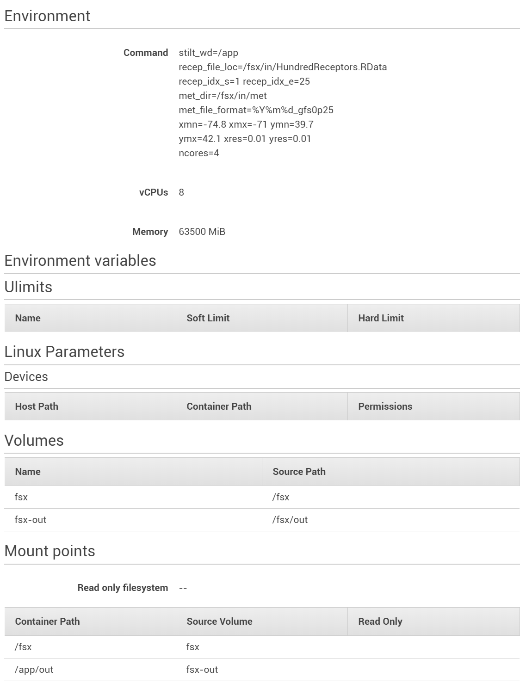

# Creating and using Docker container for AWS Batch-based STILT
## Obtaining the code

* Refer to [roughly the same instructions as AWS-ParallelCluster](https://github.com/jimmielin/cs205-spring-20-final/blob/master/docs/stilt_aws_slurm_workflow.md) to install STILT on a host machine to create the docker container. A quick recap using Spack:

```
sudo yum install libcurl-devel
spack install netcdf-c@4.7.3 r@3.6.3 proj@5.0.1 gdal@2.3.0 udunits@2.2.26 geos@3.6.2
export PATH=$(spack location -i openmpi)/bin:$PATH
export PATH=$(spack location -i netcdf-c)/bin:$PATH
export PATH=$(spack location -i r)/bin:$PATH

export HOME_PROJ=$(spack location -i proj@5.0.1)
export HOME_GDAL=$(spack location -i gdal)
export HOME_UDUNITS=$(spack location -i udunits)
export HOME_GEOS=$(spack location -i geos)
export HOME_NETCDF=$(spack location -i netcdf-c)
export HOME_R=$(spack location -i r)

export PATH=$HOME_PROJ/bin:$HOME_GDAL/bin:$HOME_UDUNITS/bin:$HOME_GEOS/bin:$PATH
export LD_LIBRARY_PATH=$HOME_PROJ/lib:$HOME_GDAL/lib:$HOME_UDUNITS/lib:$HOME_GEOS/lib:$HOME_NETCDF/lib:$LD_LIBRARY_PATH
```

In R:
```R
devtools::install_github('benfasoli/uataq')
require('uataq')
```

* Obtain STILT:
```R
uataq::stilt_init('stilt_batch_multi')
```

* Go to `stilt_batch_multi/` and **replace** with the Batch-enabled enhancements we have developed from [reproducibility/aws-batch](https://github.com/jimmielin/cs205-spring-20-final/tree/master/reproducibility/aws-batch).

* This run directory is now ready to be packaged into Docker.

## Creating container

* Install Docker and enable the service. Make sure `docker info` works under your current user priviledges.

For details, check https://docs.aws.amazon.com/AmazonECS/latest/developerguide/docker-basics.html, an excellent Amazon ECS tutorial.

* Use this modified CentOS 7-based `Dockerfile` for batch applications:
```
FROM centos:7
ENV R_LIBS_USER /app/rlibs

RUN yum -y install epel-release && yum -y install R

RUN R --version

RUN R -e "install.packages('devtools', repos='http://cran.us.r-project.org')"
RUN R -e "install.packages('Rcpp', repos='http://cran.us.r-project.org')"
RUN R -e "install.packages('raster', repos='http://cran.us.r-project.org')"
RUN R -e "install.packages('dplyr', repos='http://cran.us.r-project.org')"
RUN R -e "install.packages('parallel', repos='http://cran.us.r-project.org')"

RUN yum -y install netcdf netcdf-devel
RUN yum -y install libgfortran4

RUN R -e "install.packages('ncdf4', repos='http://cran.us.r-project.org')"
RUN R -e "install.packages('rslurm', repos='http://cran.us.r-project.org')"

WORKDIR /app

COPY . /app

ENV TZ UTC

VOLUME ["/app/in", "/app/out"]

ENTRYPOINT ["/app/r/stilt_cli_multi.r", \
                "stilt_wd=/app/", \
                "met_dir=/app/in/met"]
```

* Create the docker container: `docker built -t stilt .`. This will take a while.
* Verify the docker container operates correctly: This assumes you are using the ParallelCluster-based environment to build the container for testing.
```
docker run --rm --mount type=bind,source=/shared,destination=/app/in,readonly   --mount type=bind,source=/shared/out,destination=/app/out   stilt   stilt_wd=/app   recep_file_loc=/app/in/HundredReceptors.RData   recep_idx_s=5 recep_idx_e=10   met_dir=/app/in/met met_file_format=%Y%m%d_gfs0p25   xmn=-74.8 xmx=-71 ymn=39.7 ymx=42.1 xres=0.01 yres=0.01   ncores=1
```

## Upload container to Amazon ECR
* Upload the container for use in AWS Batch. Configure AWS using `aws configure` on the working machine.

* Create a docker repository on AWS ECR:
```
aws ecr create-repository --repository-name stilt --region us-east-2
```

* Verify it works: `aws ecr describe-repositories`
```
{
    "repositories": [
        {
            "repositoryUri": "132714586118.dkr.ecr.us-east-2.amazonaws.com/stilt",
            "imageScanningConfiguration": {
                "scanOnPush": false
            },
            "registryId": "132714586118",
            "imageTagMutability": "MUTABLE",
            "repositoryArn": "arn:aws:ecr:us-east-2:132714586118:repository/stilt",
            "repositoryName": "stilt",
            "createdAt": 1588730067.0
        }
    ]
}
```

* Upload:
```
docker tag stilt 132714586118.dkr.ecr.us-east-2.amazonaws.com/stilt
```

## Configuring AWS Batch Environment
**Warning: Do not use the "Quick Start" functionality in AWS Batch.** It seems to reject a custom launch template or AMI input, which will be crucial to making this work.

* **Deploy an Amazon FSx High-Performance Lustre Storage.** See details in the main docs. Note down the `file_system_id` and mounting name (e.g. `/c5lb5bmv`). AWS has recently changed this so you **cannot** directly mount using `DNS@tcp:/fsx` format anymore, you have to do it like `DNS@tcp:/mount_point_name`.

* **Create a `StiltBatchLT` launch template**. Key details include:
  + EBS `/dev/xvda` @ 30 GiB, `gp2` type
  + **User data** customized:
    ```
    MIME-Version: 1.0
    Content-Type: multipart/mixed; boundary="==MYBOUNDARY=="

    --==MYBOUNDARY==
    Content-Type: text/cloud-config; charset="us-ascii"

    runcmd:
    - file_system_id_01=fs-0a65a1969f67faf8b
    - region=us-east-2
    - fsx_directory=/fsx
    - amazon-linux-extras install -y lustre2.10
    - mkdir -p ${fsx_directory}
    - mount -t lustre ${file_system_id_01}.fsx.${region}.amazonaws.com@tcp:/c5lb5bmv ${fsx_directory}

    --==MYBOUNDARY==--
    ```

* **Modify your security groups in the VPC to make FSx accessible.** Instructions [are available from AWS here for allocating the correct security groups](https://docs.aws.amazon.com/fsx/latest/LustreGuide/troubleshooting.html).

* Create the compute environment (optionally using Spot).
  + It is crucial to use AMI ID `ami-0d9ef3d936a8fa1c6` for **Amazon Linux 2** in order to have Lustre available.
  + Allocate the same vpcId and Subnets as your FSx installation.
  + **Choose the correct Launch Template** you have created above.

* Create the job queue attached to the above compute environment.
* Create the job definition:

<p align="center">
  
</p>